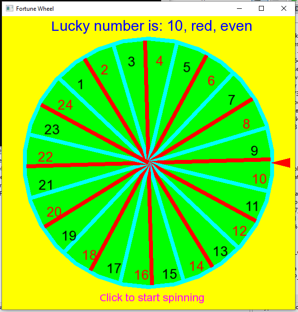

<H1>Fortune Wheel for a doubtfull choice</H1>
Draws a spinning silly wheel witn N numbers to choose the lucky one. 
Uses <A href="https://www.sfml-dev.org/download/">SFML-2.6</A> for drawing. 
<B>/F_Wheel</B> contains a version compilled for Windows 10 and required font and .dll's. 

Launch <B>FortuneWheel.exe</B> in command line and put the number of chances (N) from 2 to 36 (zero excluded) and click to start spinning. 
<B>Good luck to all!</B>
